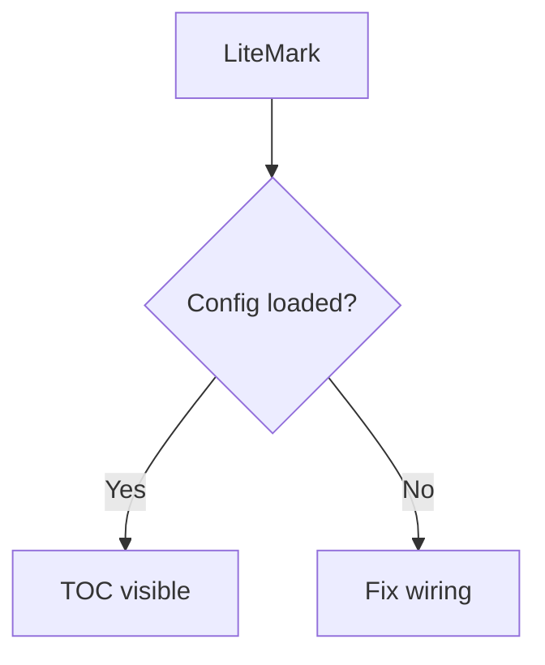

# LiteMark Test

This is a test file for verifying **LiteMark** features after the asset + TOC + config iteration.

## Features

- [x] Callouts
- [ ] TOC sidebar (check headings below)
- [x] Frontmatter (see top)
- [ ] Math and Mermaid
- [x] Task toggle (try clicking in preview)

## Callouts

> [!NOTE]
> This is a note callout.

> [!TIP]
> Tip with **bold**.

> [!WARNING]
> Warning callout.

## Math

Inline $E = mc^2$ and display:

$$
\int_0^\infty e^{-x^2} dx = \frac{\sqrt{\pi}}{2}
$$

## Mermaid Diagram

## More Headings for TOC

### Level 3

#### Level 4

Content here to test scroll and TOC navigation.

### Another section

Tables too:

| Feature | Status | Notes |
|---------|--------|-------|
| Assets  | Done   | Script + fetched |
| TOC     | Done   | Sidebar wired |
| Config  | Done   | .litemark.toml + merge |

End of test.
